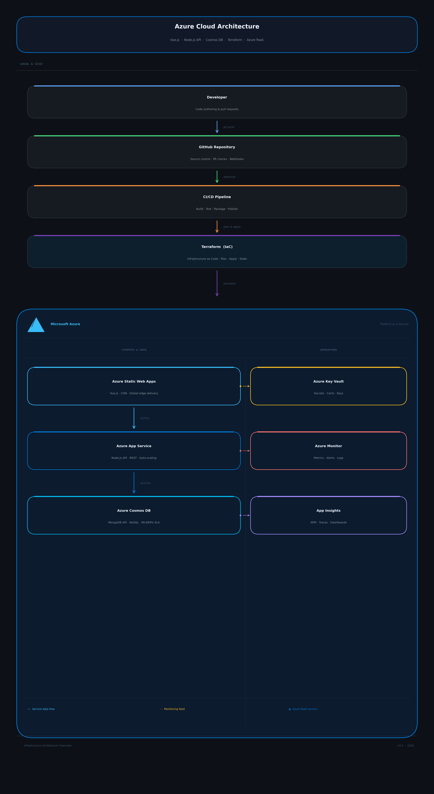

# PRODYNA DevOps Challenge

This repository contains my solution for the PRODYNA DevOps / Automation Engineer task.

## 1. Task Understanding

The goal is to design a cloud environment including CI/CD for a Single Page Application consisting of:

- Vue.js frontend
- Node.js backend
- MongoDB-compatible NoSQL database

The target hyperscaler is Microsoft Azure.

The solution should fulfill the following requirements:

- preferred usage of Platform as a Service components
- full description of the infrastructure as code
- full automation of infrastructure deployment and application build/deploy jobs
- support for fast development cycles through cloud-native technologies

---

## 2. Solution Design

## Architecture Diagram



## Preferred solution

I would choose the following Azure-based PaaS architecture:

- **Frontend:** Azure Static Web Apps
- **Backend:** Azure App Service
- **Database:** Azure Cosmos DB with MongoDB API
- **Secrets / configuration:** Azure Key Vault
- **Monitoring / observability:** Azure Monitor + Application Insights

### Why this solution?

This architecture minimizes operational overhead by using managed Azure services.  
It supports fast deployments, easy scaling and reduced maintenance effort.  
It is especially suitable for teams that want to focus on development speed and reliability instead of managing infrastructure manually.

The cloud-native architecture together with automated CI/CD pipelines enables fast development cycles and rapid feature delivery.

### Alternative solution

As an alternative, the application could also be deployed container-based on Azure Kubernetes Service (AKS).  
This would provide more flexibility and portability, but it would also increase operational complexity significantly.  
Since the task explicitly prefers PaaS components, I would not choose AKS as the preferred solution.

---

## 3. PaaS Components

The following Azure services would be used:

- Azure Static Web Apps
- Azure App Service
- Azure Cosmos DB (MongoDB API)
- Azure Key Vault
- Azure Monitor / Application Insights
- GitHub Actions or Azure DevOps Pipelines

The CI/CD pipeline automates both infrastructure provisioning and application deployment.
Terraform is executed through the pipeline to provision or update infrastructure.
The Vue.js frontend and Node.js backend are built automatically and deployed to Azure services after successful builds.

---

## 4. Infrastructure as Code

Terraform is used as the Infrastructure as Code tool.

### Why Terraform?

- cloud-independent and widely adopted
- good modularization
- suitable for CI/CD integration
- versionable in Git

### Terraform environments

The infrastructure is separated into three stages:

- dev
- staging
- prod

Each stage has its own Terraform entry point.

Terraform is used to provision:

- resource groups
- app services
- static web app resources
- cosmos DB
- key vault
- monitoring components

---

## 5. Git / Repository Structure

The repository is structured as follows:

```text
prodyna-devops-challenge
│
├── README.md
├── architecture/
├── terraform/
│   ├── dev/
│   ├── staging/
│   └── prod/
├── pipelines/
│   ├── ci.yml
│   └── cd.yml
└── presentation/


## 6. Implementation – Architect Perspective

### Infrastructure Code Repository Structure

The repository is structured to clearly separate infrastructure code, pipelines and documentation.

prodyna-devops-challenge
│
├── README.md
├── architecture/
│   └── azure-cloud-architecture.png
│
├── terraform/
│   ├── dev/
│   ├── staging/
│   └── prod/
│
├── pipelines/
│   ├── ci.yml
│   └── cd.yml
│
└── presentation/

Terraform is used to provision infrastructure for the three stages (dev, staging and prod).  
This structure allows independent deployments for each environment while keeping the infrastructure code organized and maintainable.

Different technologies are clearly separated:
- infrastructure code (Terraform)
- pipeline definitions (CI/CD)
- architecture documentation
- presentation material


### CD Tooling

For this solution I would primarily use a push-based deployment approach using GitHub Actions or Azure DevOps Pipelines.

Push-based pipelines are well suited for PaaS architectures because infrastructure provisioning and application deployments can be triggered automatically after code changes.

For Kubernetes-based environments a pull-based GitOps approach could also be considered using tools like ArgoCD or Flux. In such a setup the cluster continuously synchronizes its desired state from the Git repository.

Since this solution relies on Azure PaaS services, a push-based pipeline approach is the simpler and more pragmatic choice.


### Branching Strategy

A simple GitFlow-inspired branching strategy would be used.

main  
Represents the production-ready state of the infrastructure and application.

develop  
Integration branch where new features and infrastructure changes are combined and validated.

feature/*  
Used for development of new features or infrastructure modifications.

Developers work in feature branches and create Pull Requests to merge changes into the develop branch.  
After successful validation and testing, changes are merged into the main branch for production deployment.


### Merge Strategy

All changes must be merged via Pull Requests.

The main branch is protected and requires:

- at least one code review
- successful CI pipeline execution
- no direct commits allowed

Production deployments are triggered only from the main branch.  
This ensures that only validated and reviewed changes reach the production environment.


### Infrastructure Traceability

To ensure that the deployed infrastructure always matches the repository state, all infrastructure changes are managed via Terraform and versioned in Git.

Infrastructure deployments are executed exclusively through CI/CD pipelines.

The Terraform state would be stored centrally (for example in Azure Storage), enabling comparison between the Git repository, pipeline runs and the deployed infrastructure.

This approach guarantees that every infrastructure version can be traced back to a specific Git commit and pipeline execution, ensuring full transparency and reproducibility.
